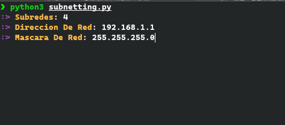
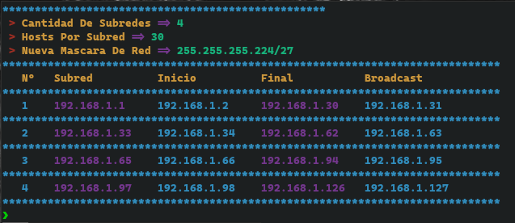

# subnetting

***this python script makes it easy to create subnets***

- *Run script with python*

        python3 subnetting.py

### or

- *Give permission of execution*

        chmod u+x subnetting.py

- *Run script*

        ./subnetting.py

### 📸 Screenshots 📸

  

### Sopported

